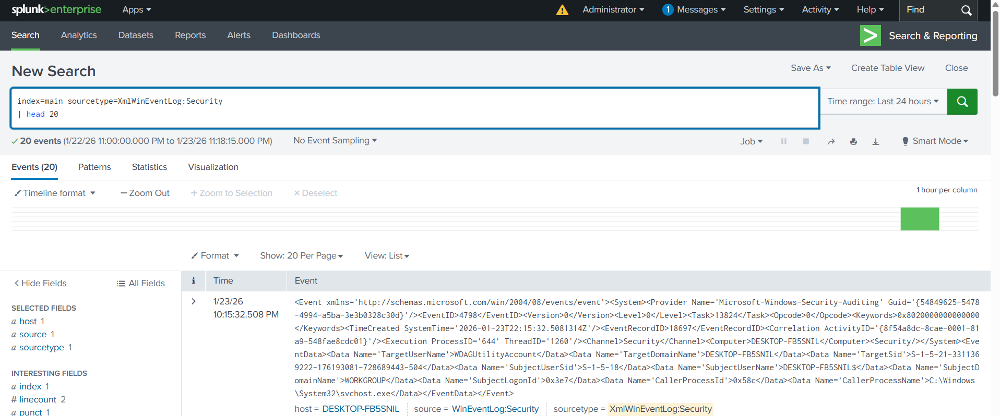
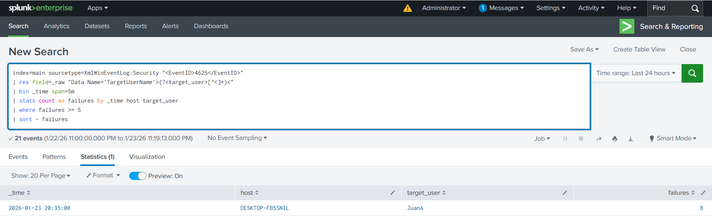
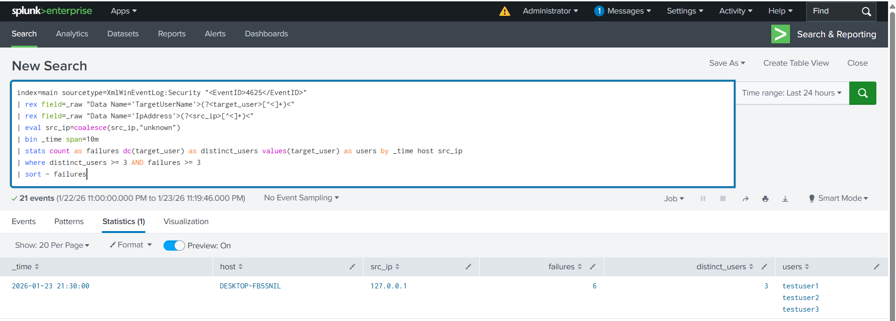
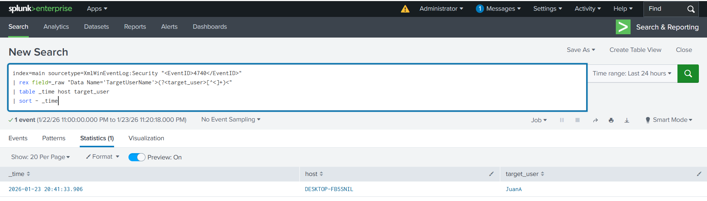
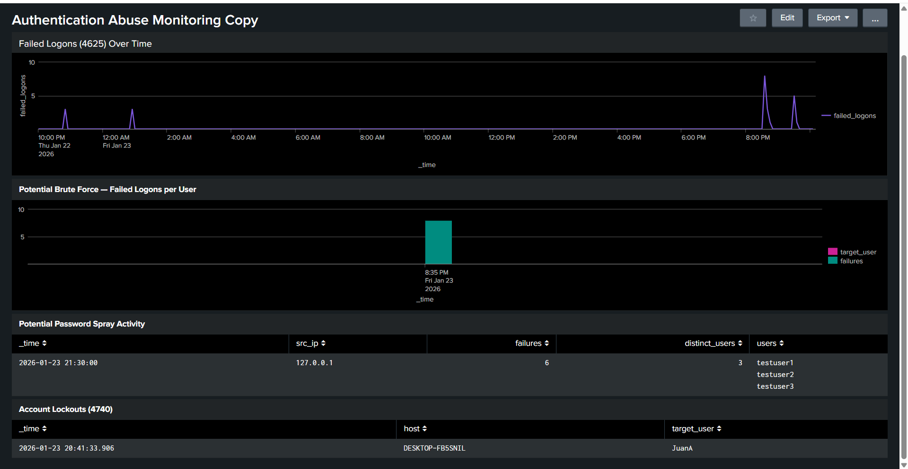

# Authentication Abuse Detection with Splunk

## Overview

This project demonstrates detection engineering techniques for identifying Windows authentication abuse using native Security logs ingested into Splunk.

The focus is on detecting brute-force attacks, password spray attacks, and account lockouts through validated telemetry, tuned thresholds, and SOC-style visualization.

---

## Environment

- Windows 10 VM (local users)
- Splunk Enterprise (Linux VM)
- Splunk Universal Forwarder
- Windows Security Logs (`XmlWinEventLog:Security`)

---

## Telemetry Validation

Before building detections, the lab validated end-to-end telemetry health:

- Confirmed Windows generated failed logon events (Event ID 4625)
- Added and validated `WinEventLog://Security` input
- Verified Security events were ingested into Splunk via XML
- Confirmed account lockout events (Event ID 4740)

#### Security Log Ingestion Validation

---

## MITRE ATT&CK Mapping

| Detection Category | Tactic | Technique | ID | Notes |
|---|---|---|---|---|
| Brute Force Login | Credential Access | Brute Force: Password Guessing | T1110.002 | Depth-based: repeated failures against a single account (Event ID 4625) |
| Password Spray Detection | Credential Access | Brute Force: Password Spraying | T1110.003 | Breadth-based: multiple accounts targeted from one source (Event ID 4625) |
| Account Lockout Alerting | Credential Access | Brute Force | T1110 | Support signal: validates impact/outcome via account lockout (Event ID 4740) |

For a visual reference of the mapped techniques in the ATT&CK matrix, see:
https://attack.mitre.org/techniques/T1110/

---

### Brute Force Detection

Identifies high-volume failed logons targeting a single user within a short time window.

- MITRE ATT&CK: **T1110.002 — Brute Force: Password Guessing**
- Event ID: 4625
- Threshold: ≥ 5 failures in 5 minutes per user  
- Pattern Type: Depth-based authentication abuse  

#### Brute Force Detection — 4625 Burst Behavior

---

### Password Spray Detection

Identifies low-volume failed logons across multiple distinct users from a single source.

- MITRE ATT&CK: **T1110.003 — Password Spray**
- Event ID: 4625
- Threshold: ≥ 3 users and ≥ 3 failures within 10 minutes  
- Pattern Type: Breadth-based authentication abuse  

#### Password Spray Detection — Multi-User Targeting

---

### Account Lockout Detection

Identifies accounts locked due to authentication abuse.

- MITRE ATT&CK (support signal): **T1110 — Brute Force Authentication**
- Event ID: 4740
- Purpose: Confirms real impact of failed authentication attempts  

#### Account Lockout Validation — Event ID 4740

Detection searches are stored in the `searches/` directory.

---

## Detection Dashboard

A Splunk dashboard was developed to centralize visibility into authentication abuse patterns and support analyst triage.

The dashboard consolidates:

- Failed logons over time
- Brute-force burst detection
- Password spray behavior
- Account lockouts (Event ID 4740)

The objective is to provide:

- Rapid pattern recognition
- Threshold validation
- Lockout impact awareness
- SOC-style operational visibility

#### Dashboard Overview

The dashboard export is available in the `dashboard/` directory.

---

## Key Takeaways

- Authentication abuse patterns must be differentiated by depth (brute force) vs breadth (spray)
- Detection thresholds should be tuned to real environment behavior
- XML-based Windows logs require intentional parsing strategies
- Visualization supports rapid SOC triage and signal clustering

---

## Future Work

- Endpoint telemetry enrichment using Sysmon
- Correlation of authentication abuse with post-authentication behavior
- Alerting and response automation

